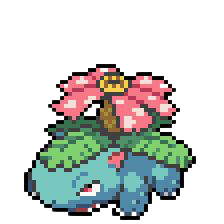

## Ivens Joris (vensauro )

 

<!--  -->

- 🌱 I’m currently learning game development with unity and math
- 👯 I’m looking to collaborate on [he4rt/react4noobs](https://github.com/he4rt/react4noobs)
- 🤔 I’m looking for help with game development math
- 💬 Ask me about anything that i have worked
- 😄 Pronouns: He/Him
- ⚡ Fun fact: I'm an pokémon

### Where to find me 📬:

### Have worked with 👾:
- Programming: Javascript(Typescript), Java, C#, Python, Php 
- Game Engines: Unity, GameMaker
<!-- - Server Technologies: RabbitMQ -->
- Front-end: React, Redux, HTML, CSS, Vuejs, Material Ui, Tailwind
- Infra: Docker, Caprover
- Databases: Postgresql, MongoDB, MySQL
<!-- - Agile practices: Extreme Programming, Scrum -->
- Mobile: Flutter, React native

<!-- 
 
     
    
    
    
    
     
    

 -->

<!-- ## Coding Activity 👩🏽‍💻

 

 -->

## Now Playing 🎧
 

